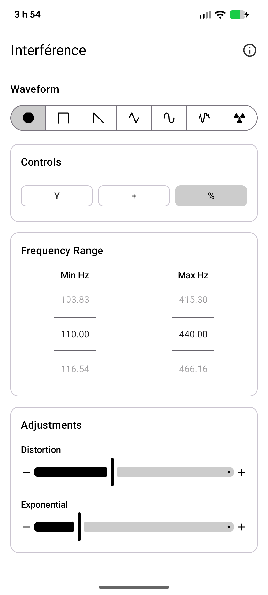

# Interférence

A real-time sound wave oscillator Android app that uses the accelerometer to dynamically adjust the frequency. It leverages the high-performance [Oboe](https://github.com/google/oboe) audio library for low-latency sound synthesis.

## Features

- **Multiple Waveforms**: Supports Sine, Square, Sawtooth, Triangle, Noise, and a unique "Radioactive" (Geiger-like) mode.
- **Sensor Integration**: Uses device orientation to control wave parameters in real-time.
- **Wave Manipulation**: Adjust distortion, exponential scaling, and inversion.
- **High Performance**: Built with C++ and Oboe for minimal audio latency.
- **Modern UI**: Developed using Jetpack Compose and Material 3.

## Screenshots

<p align="center">
  
</p>

## Requirements

- Android 8.0 (API level 27) or higher.
- A device with an accelerometer for full sensor-based interaction.

## Building

To build the project, use the following Gradle command:

```bash
./gradlew :app:assembleDebug
```

## License

This project is licensed under the **GNU General Public License v3.0**. See the [LICENSE](LICENSE) file for details.

## Credits

Developed by **Justin Michaud-Ouellette**.
Website: [justinmo.ca](https://www.justinmo.ca)
